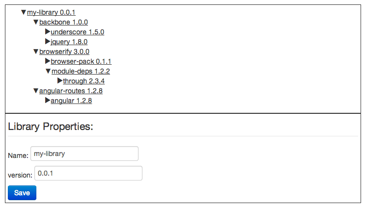

# AngularJSTest
AngularJS interview test

## Story
It's getting tough to keep track of all the dependencies for our project's library. A web tool which we can browse each dependency would be helpful.  Ignore for the time being that this is a silly idea!

## Task
Using the wireframe shown below, create an AngularJS app which functions as a dependency viewer.

    
    
Use the JSON data (shown below) to create a dependency tree. You should be able to expand and collapse the tree nodes as well as click on a node to view details. Ability to edit and save the node is optional (otherwise just show the information as text).

```
[
  {
    "name": "my-library",
    "version": "0.0.1",
    "deps": [
      {
        "name": "backbone",
        "version": "1.0.0",
        "deps": [
          {
            "name": "underscore",
            "version": "1.5.0"
          },
          {
            "name": "jquery",
            "version": "1.8.0"
          }
        ]
      },
      {
        "name": "browserify",
        "version": "3.0.0",
        "deps": [
          {
            "name": "browser-pack",
            "version": "0.1.1"
          },
          {
            "name": "module-deps",
            "version": "1.2.2",
            "deps": [
              {
                "name": "through",
                "version": "2.3.4"
              }
            ]
          }
        ]
      },
      {
        "name": "angular-routes",
        "version": "1.2.8",
        "deps": [
          {
            "name": "angular",
            "version": "1.2.8"
          }
        ]
      }
    ]
  }
]
```


